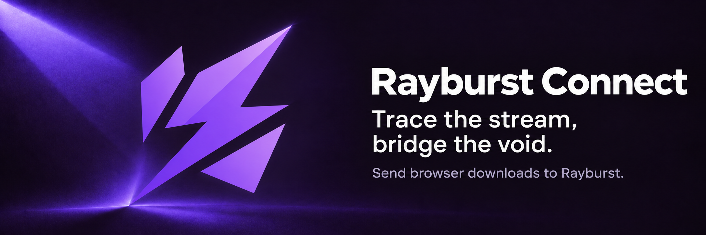

# Rayburst Connect

Trace the stream, bridge the void.

Send browser downloads to [Rayburst](https://github.com/AnInsomniacy/rayburst).
Rayburst Connect supports Chromium browsers and Firefox, with controls for download
interception, site rules, request context and media discovery.

## What it does

- Hand browser downloads to Rayburst, with an explicit receipt to prevent duplicates.
- Send links, images, audio and video from the browser's context menu.
- Discover media in the current page and choose tracks through Rayburst's media API.
- Open the media controls beside a player, or use the popup's Media tab.
- Activate Rayburst through the browser's Native Messaging API.
- Configure site exclusions, filename filters and browser fallback behavior.

The extension observes native browser events and public media elements. It does not
patch site players, read response bodies or bypass protected media.

## Build and load

Use Node.js and pnpm versions pinned by `.nvmrc` and `package.json`.

```sh
pnpm install
pnpm build
pnpm build:firefox
```

Load `.output/chromium-mv3` with **Load unpacked** in Chrome or Edge.
For Firefox, load `.output/firefox-mv3/manifest.json` as a temporary extension from
`about:debugging`. Run `pnpm dev` or `pnpm dev:firefox` for development.

Chromium development sessions retain settings in `.wxt/chrome-data`. This directory
contains browser data, including the API secret; keep it when cleaning build output.

Both development and production Chromium builds carry the same local Rayburst
Connect identity. This identity is independent of any browser store listing.
Firefox uses `rayburst-connect@aninsomniacy.dev`.

## Connect to Rayburst

Start Rayburst once to register its Native Messaging host. Copy its Extension API
port and secret from Advanced settings into the extension. The default port is
`29110`; the engine RPC port and secret are separate settings.

Rayburst Connect requires the Rayburst product identifier in capability responses.
It does not fall back to another desktop product or import its settings backups.

## Checks and packaging

```sh
pnpm compile
pnpm test
pnpm lint
pnpm lint:i18n
pnpm format:check
pnpm media:contract:check
pnpm build
pnpm build:firefox
pnpm zip:all
```

Test browser interception and native activation in the actual browser and desktop app.

## Documentation

- [Download handoff](docs/DOWNLOADS.md)
- [Media discovery](docs/MEDIA.md)
- [Media API](docs/MEDIA_API.md)
- [Brand assets](docs/BRAND.md)
- [Release configuration](docs/RELEASING.md)
- [Privacy](PRIVACY_POLICY.md)
- [Contributing](docs/CONTRIBUTING.md)

Built with WXT, Vue 3, Naive UI and Zod. Licensed under [MIT](LICENSE).
